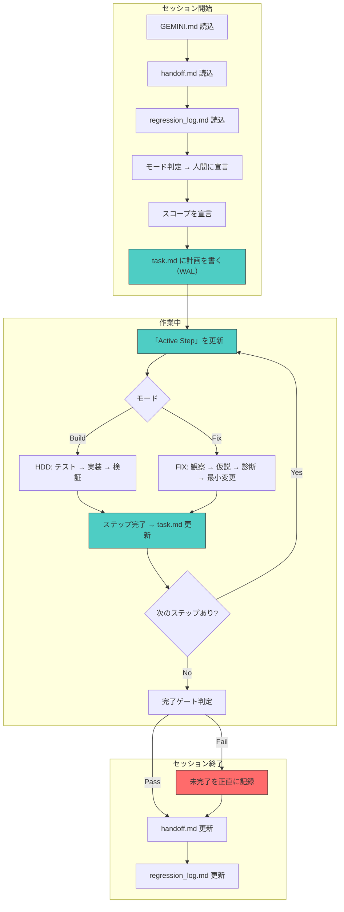

# 憲章再設計の検討記録

> この文書は、2026-04-13 のセッションにおける GEMINI.md（AI開発憲章）の再設計に関する議論を記録したものである。

---

## 1. 問題の発端

日本語PDF描画の修正が **5セッション以上にわたり「完了→再発」を繰り返した**。
各セッションのAIは「これで完全に解決しました」と報告するが、実際には未解決であり、次のセッションでは過去の失敗を忘れて同様のアプローチを再試行していた。

### 反復パターンの時系列

| # | 会話 ID | 主な修正対象 | 報告された根本原因 | 結果 |
|---|---------|-------------|-------------------|------|
| 1 | `74b103e6` | CMap / CID マッピング | `Identity-H` フォールバック、定義済み CMap 不足 | 「完了」→ 次で再発 |
| 2 | `9d60fe32` | テキスト変位式、二重変換 | CTM の二重適用、`compute_offset` のバイト演算バグ | 「完了」→ 次で再発 |
| 3 | `e8855a35` | 座標系同期、FontMatrix 継承 | Y軸反転、FontMatrix 未継承、0.001 スケールの二重適用 | 「完了」→ 次で再発 |
| 4 | `0d33f396` | FontMatrix 標準化、グリフ幅同期 | SDK/Renderer 間のスケール不一致 | 「完了」(最新) |

### 「モグラ叩き」パターン

各セッションで1つの原因を特定・修正するが、その修正が別の箇所にリグレッションを引き起こし、次のセッションでそれが新たな「根本原因」として報告される。

---

## 2. 構造的原因の分析

個々のバグではなく、以下の3つの構造的問題が反復の真因：

### A. AIの「忘れっぽさ」の具体的影響

1. **プロジェクト全体を一度に把握できない** — `content.rs` だけで60KB。全 crate の同時読み込みは物理的に不可能
2. **過去の試行錯誤が消える** — 「Aを試して失敗した」という経緯が次のセッションで白紙
3. **全体像を見失い局所最適に陥る** — 見えている範囲だけで「直った」と判断
4. **セッション内でも初期の文脈を忘れる** — 後半は前半の決定理由を忘れている

### B. テスト不在による品質ゲート欠如

- 検証が目視確認のみに依存
- リグレッション検出メカニズムが存在しない

### C. プロジェクト状態の虚偽記載

- ROADMAP 上では Phase 18 が「完了」だが、実態と乖離
- 次の AI セッションに「解決済み」という誤った前提を与えていた

---

## 3. 「開発」と「修正」の本質的違い

Phase 1〜16（開発）は比較的スムーズに進んだが、Phase 18（修正）で破綻した。
これは同じ手法で異なる性質の活動に臨んだことが原因。

|  | 開発（Build） | 修正（Fix） |
|---|---|---|
| **正解の定義** | 仕様書に書いてある | 「こう見えるべき」「前はこうだった」 |
| **必要な理解** | 仕様 + 実装予定箇所 | 既存コード全体の挙動 |
| **作業の方向** | 前方：無から作る | 後方：なぜ壊れているか探る |
| **変更の量** | 大きくてよい（新規コード） | 最小であるべき（既存への介入） |
| **リスク** | 設計ミス → やり直せる | リグレッション → 別の場所が壊れる |
| **自信の効用** | 有用（素早く決断して前に進む） | 危険（「直った」と思い込む） |
| **スコープ** | 広くてよい（機能全体） | 狭くないと危険（一変更ずつ） |
| **履歴の重要性** | 低い（新しく作るので） | 極めて高い（何を試して何が起きたか） |

### 現在の憲章が「開発」に最適化されている

- **推論より実証** → 開発では「テストを書いて実装」で機能する。修正では「何を実証すべきか」自体が不明
- **命令調の維持** → 開発では素早い決断が有用。修正では確信を持って誤報告する
- **SSoT の遵守** → 開発では仕様書が正解を提供。修正では「なぜ壊れているか」は仕様書に書いていない

---

## 4. 現在の憲章の暗黙の前提

現在の GEMINI.md には以下の暗黙の前提がある：

> **「AIは連続した一人の開発者である」**

実際には、各セッションのAIは **「毎回新しく雇われる、優秀だが経験ゼロの契約開発者」** に近い。

| | 人間の開発者 | AIセッション |
|---|---|---|
| 記憶 | 不完全だが持続する | セッション単位で完全リセット |
| 直感 | 「これは怪しい」と感じられる | 見えているものを額面通り受け取る |
| 責任 | 明日も自分のコードと付き合う | セッション終了で関与が終わる |
| 全体像 | 頭の中にぼんやりと常にある | 読み込んだファイルの範囲だけ |
| 失敗の学習 | 身体的に覚えている | 記録しなければ消える |

---

## 5. 憲章の再設計案（合意済み方向性）

### 新しい構造

```
GEMINI.md
├── AI 始動時命令（前文）
│   ├── 作業モード（Build / Fix）の判定
│   ├── 引き継ぎファイル・失敗記録の読み込み
│   └── 方針判断は人間に委ねる宣言
│
├── 共通原則（どのモードでも不変）
│   ├── 1. 推論より実証（既存・強化）
│   ├── 2. 記憶の外部化（新規）
│   └── 3. 正直な状態報告（新規）
│
├── モード定義
│   ├── Build モード → HDD_PROTOCOL へ
│   └── Fix モード → FIX_PROTOCOL へ（新設）
│
└── プロトコル索引（既存・拡張）
```

### 共通原則の定義

#### 原則 1: 推論より実証（既存・強化）

現在の文言を維持しつつ、「実証」の定義を厳密化：
- **目視確認は実証ではない**
- 自動テストの通過、またはリファレンス実装との数値比較が実証

#### 原則 2: 記憶の外部化（新規）

- セッション間で必要な情報はすべてプロジェクト内のファイルに書き出す
- 書き出されていない知識は「存在しない」ものとして扱う
- AI の物理的制約を認め、それを仕組みで補完する宣言

#### 原則 3: 正直な状態報告（新規）

- ROADMAP、task.md 等は検証済みの事実のみを反映する
- テストで実証されていない「完了」は記載禁止

### 削除する原則

**「命令調の維持」** — スタイルガイドであり哲学ではない。Fix モードでは有害（確信を持って誤報告する）。PLANNING_PROTOCOL の言語セクションへ移管、または完全削除。

### Build モードの原則

既存の HDD プロトコルがそのまま適用される：
1. 仕様を読む（Spec-Source）
2. 失敗するテストを書く（Fail-Fast）
3. 実装する（Execute）
4. テストが通る（Verify）

### Fix モードの原則（新設 FIX_PROTOCOL）

1. **認識論的謙虚さ** — 「コードを変更した」と「問題が解決した」は同義ではない
2. **診断先行** — コード変更の前に原因を特定する。仮説を複数保持する
3. **スコープの自己制限** — 一度に1つの変更のみ。検証してから次に進む
4. **リグレッション意識** — 修正が他の箇所に与える影響を常に確認する

### モードの選択方法

**AI が判断し、人間が承認する方式**（選択肢B）を採用する。
セッション開始時にAIが「この作業は Fix モードで進めます」と宣言し、人間が承認する。

---

## 6. プロセス設計（レベル2 — 合意済み）

### 6.1. セッション・ライフサイクル

すべてのセッションは以下の「型」に従う。

**開始時**:
1. GEMINI.md を読む
2. `.agent/session/handoff.md` を読む（前セッションの引き継ぎ）
3. `.agent/session/regression_log.md` を読む（過去の失敗）
4. モード（Build / Fix）を判定し、人間に宣言する
5. **このセッションのスコープを宣言する**（検証可能な粒度まで分解）
6. `.agent/session/task.md` に計画を書く（WAL: 実行前に意図を記録）

**作業中**:
- 各ステップの着手前に「Active Step」を更新する（WAL）
- 各ステップの完了後にチェックボックスを更新する
- 失敗やリグレッションは即座に `regression_log.md` に記録する

**終了時**:
1. 完了ゲートの判定
2. `.agent/session/handoff.md` を更新する
3. `.agent/session/regression_log.md` を更新する（当セッションの学び）
4. 完了していない作業を **正直に「未完了」と報告**する

---

### 6.2. Fix モードのプロセス（FIX_PROTOCOL）

Fix モードは **科学的方法** に基づく。開発が「設計→実装」なのに対し、修正は「観察→仮説→実験→検証」。

```
1. 現象の記述  ──→ 何が起きているか正確に記録する
2. 履歴の確認  ──→ 過去に何が試されたか regression_log を読む
3. 仮説の列挙  ──→ なぜ起きているか、候補を複数挙げる（1つに絞らない）
4. 診断の設計  ──→ プロダクションロジックを変更せずに仮説を検証する方法を考える
5. 診断の実行  ──→ ログ・テストで仮説を絞り込む
6. 最小変更    ──→ 1つだけ変更を加える
7. 効果の検証  ──→ 症状が消えたか確認する
8. リグレッション確認 ──→ 他の箇所が壊れていないか確認する
9. 記録       ──→ 何をして何が起きたか残す
```

**ステップ4の「診断」で許される変更の範囲**:
- ✅ OK: ログ出力の追加（`eprintln!` 等）
- ✅ OK: 新規テストの追加（既存コードを呼び出して値を検証する）
- ✅ OK: テスト用の診断バイナリの追加
- ❌ NG: プロダクションロジックの変更（関数のロジック書き換え）
- ❌ NG: 変換パイプラインの構造変更

基準: **「プロダクションロジックの挙動を変更しない」**。テストやログは「観測行為」であり、系を乱さない。

---

### 6.3. 完了ゲート（3段階）

| レベル | 対象 | 必要条件 |
|-------|------|---------|
| **タスク完了** | セッション内の個別タスク | テストが通る + リグレッションなし |
| **課題解決** | ある不具合の解消 | そのバグの**リグレッションテスト**が test suite に存在し PASS している |
| **マイルストーン完了** | ROADMAP のエントリ | 課題解決 + ユーザー承認 |

「課題解決」の判定は「次のセッションでの再確認」ではなく、**テストが test suite に入っていること自体が継続的な検証**として機能する。`cargo test` を回せば自動的に確認される。

---

### 6.4. Write-Ahead Log（WAL）パターン

AIはセッション中に途中停止したり、文脈が溢れて前半の計画を忘れることがある。
データベースの WAL と同じパターンで対処する：

```
1. 意図をファイルに書く  ──→ 「これからXをする」
2. 実行する              ──→ Xを実行
3. 完了をファイルに書く  ──→ 「Xが完了した」
```

中断した場合、次のセッションはファイルを読み「Xをしようとしたが未完了」と判断できる。

**「やる前に書く」** が核心。今までは逆（やった後に「完了」と記録）だった。

---

### 6.5. ファイル配置とフォーマット

> [!IMPORTANT]
> すべてのセッション状態ファイルはプロジェクト内の **固定パス** に配置する。
> 会話ごとの一時ディレクトリ（`.gemini/antigravity/brain/<id>/`）には書かない。

```
.agent/session/
├── task.md            ← 作業計画 + WAL（統合型・セッション開始時に上書き）
├── handoff.md         ← セッション終了時の状態記録（毎回上書き）
└── regression_log.md  ← 失敗の蓄積記録（追記のみ・絶対に上書きしない）
```

**task.md を統合型にする理由**: 分離型（task.md + current_step.md）だと、AIが2ファイルの同期を忘れるリスクがある。忘れっぽいAIにとって管理ファイルは少ないほど良い。

#### task.md のフォーマット

```markdown
# Task: [目的を1行で]

- **Mode**: Fix / Build
- **Scope**: [このセッションの範囲を1-2行で]
- **Session**: [日付]

## Plan

1. [x] ステップ1の説明 — 結果の要約
2. [/] ステップ2の説明
3. [ ] ステップ3の説明
4. [ ] ステップ4の説明

## Active Step

> Step 2: cmap.rs の compute_offset を読解中
>
> - cmap.rs:L150-200 を確認済み
> - バイト単位の減算を使っている → 過去のバグ（regression_log #3）と関連

## On Interrupt

Step 1 まで完了。Step 2 の途中で中断。
次のセッションは本ファイルを読み、Step 2 から再開せよ。
**やってはいけないこと**: compute_offset を整数演算に変更するアプローチは
Session e8855a35 で失敗済み（regression_log 参照）。
```

#### task.md の更新タイミング

| タイミング | やること |
|-----------|---------|
| 作業開始時 | Plan セクションに全ステップを書く |
| 各ステップ着手前 | Active Step を更新（WAL：「これからやる」） |
| 各ステップ完了後 | `[ ]` → `[x]` に更新 + 結果の要約を追記 |
| 中断/終了時 | On Interrupt セクションを書く |

#### handoff.md のフォーマット

```markdown
# Session Handoff

- **Date**: 2026-04-13
- **Mode**: Fix
- **Status**: 未完了 / 完了

## What Was Done

- CMap の compute_offset にユニットテストを追加した
- テストは PASS している

## Open Issues

- 日本語描画のバンチングは CMap の問題ではない可能性がある
- font.rs の FontMatrix 継承を未検証

## Regressions

- なし（本セッションではプロダクションコードを変更していない）

## Next Session Should

1. font.rs の FontMatrix 継承ロジックを診断する
2. regression_log #4 のアプローチは避ける
```

#### regression_log.md の運用

- **追記のみ**。絶対に過去のエントリを上書き・削除しない
- 各エントリには「試行した修正」「引き起こしたリグレッション」「学んだ不変条件」を含める
- 肥大化時（50件超）: 古いエントリを `regression_log_archive.md` に移動。ただし**「学んだ不変条件」は要約として永続保持**する。事実の時系列は捨てても、教訓は捨てない

---

### 6.6. プロセス全体図



緑 = WAL（意図の事前記録）、赤 = 失敗の正直な記録。

---

## 7. ファイル配備（レベル3 — 完了）

レベル1・2 の合意に基づき、以下のファイルを作成・改訂した。

### 新規作成

| ファイル | 役割 |
|---------|------|
| `.agent/protocols/FIX_PROTOCOL.md` | Fix モード専用プロトコル（診断先行・最小変更） |
| `.agent/session/handoff.md` | セッション引き継ぎファイル（毎回上書き） |
| `.agent/session/regression_log.md` | 失敗の蓄積記録（追記のみ、遡及4件記録済み） |

### 改訂

| ファイル | 変更内容 |
|---------|---------|
| `.agent/GEMINI.md` | 全面改訂: 共通原則3つ + Build/Fix モード分離 |
| `.agent/protocols/HDD_PROTOCOL.md` | Build モード明示、完了ゲート追加 |
| `.agent/protocols/PLANNING_PROTOCOL.md` | SSoT テーブル拡張、WAL パターン導入、引き継ぎ義務追加 |
| `.agent/session/task.md` | WAL フォーマットのテンプレートで初期化 |

### 未実施（任意）

- `verify_compliance.sh` への新チェック項目追加

---

## 8. この設計の既知の限界

> [!WARNING]
> 本プロトコル設計は AI が規約を**読んで従う**ことを前提にしている。
> 以下の限界を認識した上で運用すること。

### A. 規約の総量によるコンテキスト圧迫

GEMINI.md + handoff.md + regression_log.md + 対象プロトコルを読み込むだけで相当量のコンテキストを消費する。規約が増えるほどコードを読む余裕が減り、本末転倒になりうる。

**対策**: 規約は短く保つ。GEMINI.md は1ページ以内。各プロトコルも判定基準以外の説明は最小限にする。regression_log.md は「累積的教訓」セクションを優先的に読み、個別エントリは必要に応じて読む。

### B. AI が規約を読まない可能性

AI が始動時命令を読み飛ばした場合、全ての仕組みが機能しない。

**対策**: PLANNING_PROTOCOL にセッション開始手順を [MUST] で明記済み。ただし、これ自体も読まれない可能性があるため、完全な保証にはならない。人間が定期的に「handoff.md 読んだ？」と確認するのが最も確実。

### C. 過剰なプロセスによる速度低下

全ステップで WAL 更新、全修正後に regression_log 追記、全セッション終了時に handoff 更新——これらのオーバーヘッドが軽微なタスクにとっては過重になりうる。

**対策**: 規模の小さなタスク（ドキュメント修正、1行の修正等）では、人間の判断でプロセスの一部を省略してよい。ただし Fix モードのステップ省略は禁止（問題の再発を防ぐため）。

---

## 9. レビュー指摘事項と対応

本検討記録の完成後にレビューを実施し、以下の7件の抜け落ちを検出・修正した。

| # | 指摘 | 対応 |
|---|------|------|
| 1 | PLANNING_PROTOCOL に「命令調」が残存 | Fix モードでは不確実性を明示する表現を使う例外を追記 |
| 2 | セッション開始手順がプロトコルに未記載 | PLANNING_PROTOCOL §3.1 に [MUST] 手順を追加 |
| 3 | walkthrough.md の配置パスが未定義 | SSoT テーブルに `.agent/session/walkthrough.md` を明記 |
| 4 | Build モードの完了ゲートが薄い | HDD_PROTOCOL §6 を FIX_PROTOCOL と同等の詳細度に拡充 |
| 5 | ROADMAP Phase 18 が虚偽の [完了] | [要再検証] に変更、WARNING を追記 |
| 6 | 摩擦分析に Fix モードの経路がない | PLANNING_PROTOCOL §4 に FIX_PROTOCOL への経路を追加 |
| 7 | 設計の限界が未記述 | 本セクション（§8）を追加 |

---

## 10. 次のアクション

### 初回適用
- 日本語PDF描画問題を題材に、新憲章・新プロトコルに従って **Fix モード** で作業を再開する
- 次のセッション開始時に GEMINI.md → handoff.md → regression_log.md の順で読み込む
- FIX_PROTOCOL の修正サイクル（観察→仮説→診断→最小変更）に厳密に従う
