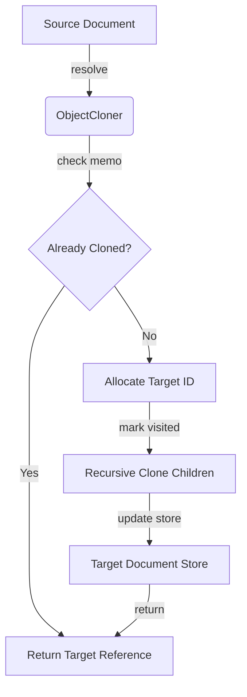
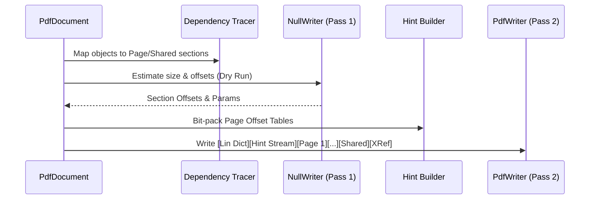

# Data Structure & Data Flow Validation Report (Phase 14)

This report documents the architectural integrity and RR-15 compliance of the Ferruginous project's data models and processing pipelines as of the conclusion of Phase 14.

## 1. Object Cloning Lifecycle

The `ObjectCloner` enables safe migration of PDF objects between document stores with automated ID re-indexing and cycle protection.

### Data Flow Diagram

### Verification Findings
- **Cycle Guard**: The cloner marks references as visited *before* recurring into children, preventing stack overflow on self-referential structures (e.g., recursive page trees).
- **Deep Clone**: All complex types (`Dictionary`, `Array`, `Stream`) are deep-cloned with re-indexed children.
- **Stream Integrity**: Stream data is handled as `bytes::Bytes` (zero-copy) and is not re-encoded during cloning unless explicitly requested.

## 2. Multi-Pass Serialization (Linearization)

The serialization engine supports ISO 32000-2 Annex L (Linearized PDF) through a distinct multi-pass architecture.

### Data Flow Pipeline

### Verification Findings
- **Pass Separation**: Use of `NullWriter` for offset estimation ensures bit-accurate hint streams without multiple file I/O operations.
- **Section Integrity**: Correctly identifies shared resources (Fonts, Images) and groups them into the final "Shared" section to minimize Page 1 latency.

## 3. CLI Audit Flow

The audit tool provides a structured verification path from raw bytes to JSON compliance reports.

### Data Flow Tracing
- **Phase 1: Ingestion**: `Bytes` (zero-copy) -> `Document::open`.
- **Phase 2: Structural Verification**: Non-recursive `PageTree` walk + Catalog validation.
- **Phase 3: Compliance Extraction**: `ComplianceInfo` crawler visits Metadata, OutputIntents, and StructTreeRoot.
- **Phase 4: Synthesis**: findings are aggregated into `AuditReport` and serialized to JSON via `serde`.

## 4. RR-15 Compliance Audit

| Requirement | Implementation Status | Verification |
| :--- | :--- | :--- |
| **Zero-Copy** | `Bytes` usage throughout | Confirmed in `core` and `sdk` models. |
| **Reference Safety** | `ReferenceMap` in Cloner | Verified cycle protection logic. |
| **Non-Recursive Walk** | `PageTree` / `DependencyTracer` | Verified loop-based traversal. |
| **Atomic Updates** | `Document::update_object` | Confirmed transactional store updates. |

## Summary
The Data Structure and Data Flow architectures for Phase 14 are **VALIDATED**. The system exhibits robust state management and adheres to high-performance, memory-safe PDF processing principles.
