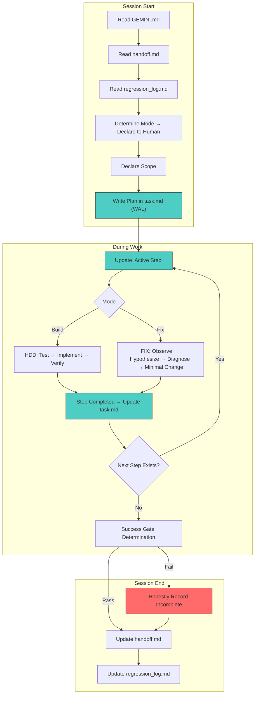

# Charter Redesign Deliberation Record

> This document records the discussions regarding the redesign of GEMINI.md (AI Development Charter) during the session on 2026-04-13.

---

## 1. Origin of the Problem

The fix for Japanese PDF rendering **repeatedly cycled through "Fixed → Recurred" for more than 5 sessions**.
While each session's AI reported "This is now fully resolved," the reality was that it remained unresolved, and the next session would forget past failures and retry the same approach.

### Chronology of Iterative Patterns

| # | Conversation ID | Primary Target | Reported Root Cause | Result |
|---|---------|-------------|-------------------|------|
| 1 | `74b103e6` | CMap / CID Mapping | `Identity-H` fallback, insufficient predefined CMaps | "Fixed" → Recurred in next |
| 2 | `9d60fe32` | Text Displacement, Double Conversion | Double application of CTM, byte operation bug in `compute_offset` | "Fixed" → Recurred in next |
| 3 | `e8855a35` | Coordinate Sync, FontMatrix Inheritance | Y-axis inversion, FontMatrix not inherited, double 0.001 scale | "Fixed" → Recurred in next |
| 4 | `0d33f396` | FontMatrix Standardization, Glyph Width Sync | Scale mismatch between SDK and Renderer | "Fixed" (Current) |

### "Whack-a-Mole" Pattern

Each session identifies and fixes one cause, but that fix causes a regression elsewhere, which is then reported as a new "root cause" in the next session.

---

## 2. Analysis of Structural Causes

The true cause of the repetition is not individual bugs, but the following three structural problems:

### A. Specific Impacts of AI "Forgetfulness"

1. **Inability to grasp the entire project at once** — `content.rs` alone is 60KB. Physically impossible to load all crates simultaneously.
2. **Loss of past trial and error** — The context that "Approach A was tried and failed" is wiped clean in the next session.
3. **Losing the big picture and falling into local optimization** — Judging "fixed" based only on the visible range.
4. **Forgetting early context even within a session** — Later parts of a session forget the reasons for decisions made in the earlier parts.

### B. Lack of Quality Gates Due to Test Absence

- Verification depends solely on visual checks.
- No regression detection mechanism exists.

### C. False Reporting of Project State

- Phase 18 is marked as "[Completed]" on the ROADMAP, but it deviates from reality.
- This provided a false premise of "problem solved" to the next AI session.

---

## 3. Fundamental Difference Between "Build" and "Fix"

Phases 1-16 (Build) proceeded relatively smoothly, but Phase 18 (Fix) collapsed. This was caused by approaching activities of different natures with the same methodology.

|  | Build | Fix |
|---|---|---|
| **Definition of Success** | Defined in specifications | "Should look like this," "Used to be like this" |
| **Required Understanding** | Spec + Target implementation area | Behavior of the entire existing code |
| **Direction of Work** | Forward: Create from nothing | Backward: Search for why it's broken |
| **Change Volume** | Can be large (new code) | Must be minimal (intervention in existing) |
| **Risk** | Design error → Restartable | Regression → Breaks something else |
| **Utility of Confidence** | Useful (fast decision and move) | Dangerous (assuming it's "fixed") |
| **Scope** | Can be broad (entire feature) | Dangerous if not narrow (one change at a time) |
| **Importance of History** | Low (creating new) | Extremely high (what was tried and what happened) |

### Current Charter is Optimized for "Build"

- **Verification Over Inference** → In Build, "write test then implement" works. In Fix, "what should be verified" itself is unclear.
- **Maintain Imperative Style** → In Build, quick decisions are useful. In Fix, reporting with certainty causes false positives.
- **Adhere to SSoT** → In Build, specs provide the answer. In Fix, "why it's broken" is not written in the specs.

---

## 4. Implicit Premise of the Current Charter

The current GEMINI.md has the following implicit premise:

> **"The AI is a single, continuous developer."**

In reality, each AI session is more like a **"newly hired, brilliant but zero-experience contract developer."**

| | Human Developer | AI Session |
|---|---|---|
| Memory | Imperfect but persistent | Completely reset per session |
| Intuition | Can feel "this is suspicious" | Takes what is visible at face value |
| Responsibility | Deals with own code tomorrow | Involvement ends with session closure |
| Big Picture | Vaguely always in mind | Only the range of loaded files |
| Learning from Failure | Physically remembers | Disappears unless recorded |

---

## 5. Charter Redesign Proposal (Agreed Direction)

### New Structure

```
GEMINI.md
├── AI Startup Commands (Preamble)
│   ├── Mode Determination (Build / Fix)
│   ├── Loading handoff files and failure records
│   └── Declaration to defer policy decisions to humans
│
├── Common Principles (Invariant in any mode)
│   ├── 1. Verification Over Inference (Existing/Strengthened)
│   ├── 2. Externalization of Memory (New)
│   └── 3. Honest Status Reporting (New)
│
├── Mode Definitions
│   ├── Build Mode → Follow HDD_PROTOCOL
│   └── Fix Mode → Follow FIX_PROTOCOL (New)
│
└── Protocol Index (Existing/Extended)
```

### Definition of Common Principles

#### Principle 1: Verification Over Inference (Existing/Strengthened)

Maintain current wording while strictifying the definition of "Verification":
- **Visual check is NOT verification.**
- Passing automated tests or numerical comparison with reference implementations IS verification.

#### Principle 2: Externalization of Memory (New)

- All information necessary between sessions must be written to files within the project.
- Knowledge not written down is treated as "non-existent."
- A declaration to acknowledge AI's physical constraints and complement them with mechanisms.

#### Principle 3: Honest Status Reporting (New)

- ROADMAP, task.md, etc., must reflect only verified facts.
- Marking as "Completed" without verification via tests is prohibited.

### Principles to Remove

**"Maintain Imperative Style"** — This is a style guide, not a philosophy. Harmful in Fix mode (reporting false positives with confidence). Transfer to the language section of PLANNING_PROTOCOL or remove entirely.

### Principles for Build Mode

Existing HDD Protocol applies as is:
1. Read specification (Spec-Source)
2. Write failing test (Fail-Fast)
3. Implement (Execute)
4. Test passes (Verify)

### Principles for Fix Mode (New FIX_PROTOCOL)

1. **Epistemological Humility** — "Changed the code" is not synonymous with "Solved the problem."
2. **Diagnosis First** — Identify the cause before changing code. Maintain multiple hypotheses.
3. **Self-Limitation of Scope** — Only one change at a time. Verify before proceeding.
4. **Regression Awareness** — Always confirm the impact of fixes on other areas.

### Mode Selection Method

Adopt **"AI Determines, Human Approves"** (Option B).
At the start of a session, the AI declares "I will proceed in Fix mode," and the human approves.

---

## 6. Process Design (Level 2 — Agreed)

### 6.1. Session Lifecycle

All sessions follow this "template."

**At Start**:
1. Read GEMINI.md
2. Read `.agent/session/handoff.md` (Handoff from previous session)
3. Read `.agent/session/regression_log.md` (Past failures)
4. Determine mode (Build / Fix) and declare to human
5. **Declare the scope of this session** (Decompose to verifiable granularity)
6. Write plan in `.agent/session/task.md` (WAL: Record intent before execution)

**During Work**:
- Update "Active Step" before starting each step (WAL)
- Update checkboxes after completing each step
- Record failures or regressions immediately in `regression_log.md`

**At End**:
1. Success gate determination
2. Update `.agent/session/handoff.md`
3. Update `.agent/session/regression_log.md` (Learnings from this session)
4. **Honestly report uncompleted work as "Incomplete."**

---

### 6.2. Fix Mode Process (FIX_PROTOCOL)

Fix mode is based on the **Scientific Method**. While Build is "Design → Implement," Fix is "Observe → Hypothesize → Experiment → Verify."

```
1. Phenomenon Description ──→ Accurately record what is happening
2. History Check         ──→ Read regression_log to see what was tried before
3. Hypothesis Enlistment ──→ List multiple candidates for why it's happening (don't narrow to one)
4. Diagnosis Design     ──→ Think of ways to verify hypotheses without changing production logic
5. Diagnosis Execution  ──→ Narrow down hypotheses using logs/tests
6. Minimal Change       ──→ Apply only one change
7. Effect Verification   ──→ Confirm if symptoms disappear
8. Regression Check     ──→ Confirm if other areas are broken
9. Recording            ──→ Leave a record of what was done and what happened
```

**Scope of changes allowed in Step 4 "Diagnosis"**:
- ✅ OK: Adding log output (e.g., `eprintln!`)
- ✅ OK: Adding new tests (invoking existing code and verifying values)
- ✅ OK: Adding diagnostic binaries for testing
- ❌ NG: Changing production logic (rewriting function logic)
- ❌ NG: Changing the structure of the conversion pipeline

Criterion: **"Do not change the behavior of production logic."** Tests and logs are "observational acts" and should not disturb the system.

---

### 6.3. Success Gates (3 Tiers)

| Level | Subject | Requirements |
|-------|------|---------|
| **Task Completion** | Individual tasks within a session | Tests pass + No regressions |
| **Issue Resolution** | Resolving a specific bug | A **regression test** for that bug exists in the test suite and is PASSING |
| **Milestone Completion** | ROADMAP entry | Issue resolution + User approval |

The determination of "Issue Resolution" is not "re-confirmation in the next session," but **the existence of the test in the test suite itself as continuous verification**. Running `cargo test` automatically confirms it.

---

### 6.4. Write-Ahead Log (WAL) Pattern

AI may stop midway through a session or forget earlier plans due to context overflow. Handle this with the same pattern as database WAL:

```
1. Write intent to file ──→ "I am about to do X"
2. Execute             ──→ Execute X
3. Write completion    ──→ "X is completed"
```

If interrupted, the next session can read the file and determine "tried to do X but incomplete."

**"Write before you do"** is the core. Previously, it was the opposite (recording "Completed" after doing it).

---

### 6.5. File Placement and Format

> [!IMPORTANT]
> All session state files must be placed at **fixed paths** within the project.
> Do not write to temporary directories per conversation (`.gemini/antigravity/brain/<id>/`).

```
.agent/session/
├── task.md            ← Work plan + WAL (Integrated type; overwritten at session start)
├── handoff.md         ← State record at session end (Overwritten every time)
└── regression_log.md  ← Accumulated record of failures (Append-only; never overwrite)
```

**Reason for integrated task.md**: With a split type (task.md + current_step.md), there's a risk of the AI forgetting to sync the two files. Fewer management files are better for forgetful AI.

#### Format of task.md

```markdown
# Task: [Purpose in one line]

- **Mode**: Fix / Build
- **Scope**: [Scope of this session in 1-2 lines]
- **Session**: [Date]

## Plan

1. [x] Step 1 description — Result summary
2. [/] Step 2 description
3. [ ] Step 3 description
4. [ ] Step 4 description

## Active Step

> Step 2: Reading compute_offset in cmap.rs
>
> - Confirmed cmap.rs:L150-200
> - Using byte-unit subtraction → related to past bug (regression_log #3)

## On Interrupt

Completed up to Step 1. Interrupted during Step 2.
The next session should read this file and resume from Step 2.
**Do not do**: Changing compute_offset to integer arithmetic was already tried
and failed in Session e8855a35 (refer to regression_log).
```

#### task.md Update Timing

| Timing | Action |
|-----------|---------|
| At Work Start | Write all steps in the Plan section |
| Before Each Step | Update Active Step (WAL: "About to do") |
| After Each Step | Update `[ ]` → `[x]` + Append result summary |
| At Interrupt/End | Write On Interrupt section |

#### Format of handoff.md

```markdown
# Session Handoff

- **Date**: 2026-04-13
- **Mode**: Fix
- **Status**: Incomplete / Completed

## What Was Done

- Added unit tests for compute_offset in CMap
- Tests are PASSING

## Open Issues

- Japanese rendering bunching might not be a CMap issue
- FontMatrix inheritance in font.rs not yet verified

## Regressions

- None (Production code was not changed in this session)

## Next Session Should

1. Diagnose FontMatrix inheritance logic in font.rs
2. Avoid the approach in regression_log #4
```

#### regression_log.md Operation

- **Append-only**. Never overwrite or delete past entries.
- Each entry includes "Fix attempted," "Regressions caused," and "Invariant conditions learned."
- When bloated (over 50 entries): Move old entries to `regression_log_archive.md`. However, **persist "Learned Invariants" as a summary.** Even if the chronology of facts is discarded, do not discard the lessons.

---

### 6.6. Overall Process Diagram



Green = WAL (Pre-record intent), Red = Honest record of failure.

---

## 7. File Deployment (Level 3 — Completed)

Based on the agreements in Levels 1 and 2, the following files were created or revised:

### Newly Created

| File | Role |
|---------|------|
| `.agent/protocols/FIX_PROTOCOL.md` | Fix mode specific protocol (Diagnosis first, minimal change) |
| `.agent/session/handoff.md` | Session handoff file (Overwritten every time) |
| `.agent/session/regression_log.md` | Accumulated record of failures (Append-only; 4 retrospective entries recorded) |

### Revised

| File | Changes |
|---------|---------|
| `.agent/GEMINI.md` | Full revision: 3 Common Principles + Build/Fix Mode separation |
| `.agent/protocols/HDD_PROTOCOL.md` | Explicit Build mode, added success gates |
| `.agent/protocols/PLANNING_PROTOCOL.md` | Extended SSoT table, introduced WAL pattern, added handoff obligation |
| `.agent/session/task.md` | Initialized with WAL format template |

### Not Implemented (Optional)

- Adding new check items to `verify_compliance.sh`.

---

## 8. Known Limitations of This Design

> [!WARNING]
> This protocol design assumes the AI will **read and follow** the regulations.
> Operate with awareness of the following limitations.

### A. Context Pressure Due to Total Volume of Regulations

Loading GEMINI.md + handoff.md + regression_log.md + target protocols alone consumes a significant amount of context. As regulations increase, the capacity to read code decreases, which could be counterproductive.

**Countermeasure**: Keep regulations short. GEMINI.md should be within one page. Each protocol should minimize explanations other than criteria. Prioritize reading the "Cumulative Lessons" section of regression_log.md and read individual entries only as needed.

### B. Possibility of AI Not Reading Regulations

If the AI skips the startup commands, none of the mechanisms will function.

**Countermeasure**: The session startup procedure is explicitly marked as [MUST] in PLANNING_PROTOCOL §3.1. However, since this itself might not be read, there's no complete guarantee. The most reliable way is for humans to periodically confirm, "Did you read handoff.md?"

### C. Slowdown Due to Excessive Process

Updating WAL for every step, appending to regression_log after every fix, updating handoff at the end of every session—this overhead can be burdensome for minor tasks.

**Countermeasure**: For small-scale tasks (doc fixes, one-line fixes, etc.), humans may decide to skip parts of the process. However, skipping steps in Fix mode is prohibited (to prevent problem recurrence).

---

## 9. Review Findings and Responses

After the completion of this deliberation record, a review was conducted, and 7 omissions were detected and corrected.

| # | Finding | Response |
|---|------|------|
| 1 | "Imperative Style" remained in PLANNING_PROTOCOL | Added exception for Fix mode to use expressions of uncertainty |
| 2 | Session startup procedure not in protocols | Added [MUST] procedure to PLANNING_PROTOCOL §3.1 |
| 3 | Walkthrough.md placement path undefined | Explicitly stated `.agent/session/walkthrough.md` in SSoT table |
| 4 | Build mode success gate was thin | Expanded HDD_PROTOCOL §6 to the same level of detail as FIX_PROTOCOL |
| 5 | ROADMAP Phase 18 falsely marked [Completed] | Changed to [Re-verification Required] and added WARNING |
| 6 | No path to Fix mode in friction analysis | Added path to FIX_PROTOCOL in PLANNING_PROTOCOL §4 |
| 7 | Design limitations not described | Added this section (§8) |

---

## 10. Next Actions

### First Application
- Resume work on the Japanese PDF rendering issue in **Fix mode**, following the new charter and protocols.
- At the start of the next session, read GEMINI.md → handoff.md → regression_log.md in order.
- Strictly follow the Fix mode cycle (Observe → Hypothesize → Diagnose → Minimal Change).
